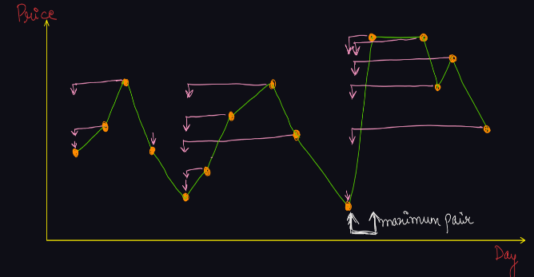

<a href="https://leetcode.com/problems/best-time-to-buy-and-sell-stock/"><h1>121. Best Time to Buy and Sell Stock</h1></a>

- <h3>Question</h3>
    You are given an array prices where prices[i] is the price of a given stock on the ith day.

    You want to maximize your profit by choosing a single day to buy one stock and choosing a different day in the future to sell that stock.

    Return the maximum profit you can achieve from this transaction. If you cannot achieve any profit, return 0.

- <h3>Examples</h3>
    

    <b>Example 1:</b>

    Input: prices = [7,1,5,3,6,4] 
    Output: 5
    Explanation: Buy on day 2 (price = 1) and sell on day 5 (price = 6), profit = 6-1 = 5.
    Note that buying on day 2 and selling on day 1 is not allowed because you must buy before you sell.
    

     
    

    <b>Example 2:</b>

    Input: prices = [7,6,4,3,1] 
    Output: 0
    Explanation: In this case, no transactions are done and the max profit = 0.
    

     

- <h3>Constraints</h3>
    → 1 <= prices.length <= 105  
    → 0 <= prices[i] <= 104

- <h3>Approach</h3>
    

    
Solution: O(N) Time & O(1) Space
    To maximize the profit, we need to find a pair so that we can buy the stock at the least possible price and sell it on a future day at the maximum price possible.
    But we cannot make a pair of the minimum element of array with the maximum element of array, because it may be possible that minimum element occurs after maximum, i.e. index of minimum element is greater than index of maximum element. Thus, the condition of a valid complete transaction will be violated.
    Hence, everyday can be a potential answer as a selling point or a buying point. We will apply our dynamic programming approach and try to solve this problem, by Travel & Solve Methodology.

    
So, what we can do is consider each day as our potential selling point. After considering a given day as a potential selling day, we will have to find a day with least price in the left part (index smaller than the selling point), which will act as the buying point.
    Thus the profit we can make with the necessary condition that today is the selling day can be calculated as arr[selling point] - arr[buying point].
    We will consider these profits for each day and find the maximum profit among them.
    

    

    What can be the smallest problem?
    I think the first day (0 index) is the smallest problem, where it has no buying point before it. Hence, the maximum profit will be 0 considering this day as a potential selling point.
    We will keep the current maximum profit = 0. Now, we will traverse the array from left to right, and will keep on updating the maximum profit, if we find a greater profit for the current day.
    

    

    But, how to find the buying point pair?
    One idea is to store the minimum element encountered so far (from days on the left). On each day, if the price is less than the msf (Minimum So Far), we will update its value. Thus, while travelling from left to right, we are able to find the buying point pair.
    

     
    

    

    <h5>Time Complexity: </h5>
    
→ Since, we are running a loop on a 1d array of size n, and calculating the minimum so far(which is constant work), hence time complexity is O(n).
    

    <h5>Space Complexity:</h5>
    
→ We are not using any extra space, but just a few integer variables, hence O(1) auxiliary space required.
    

    

- <h3>Reference</h3>
<!-- 1. [Click Here](https://youtu.be/uoFrIIrp5_g) -->
