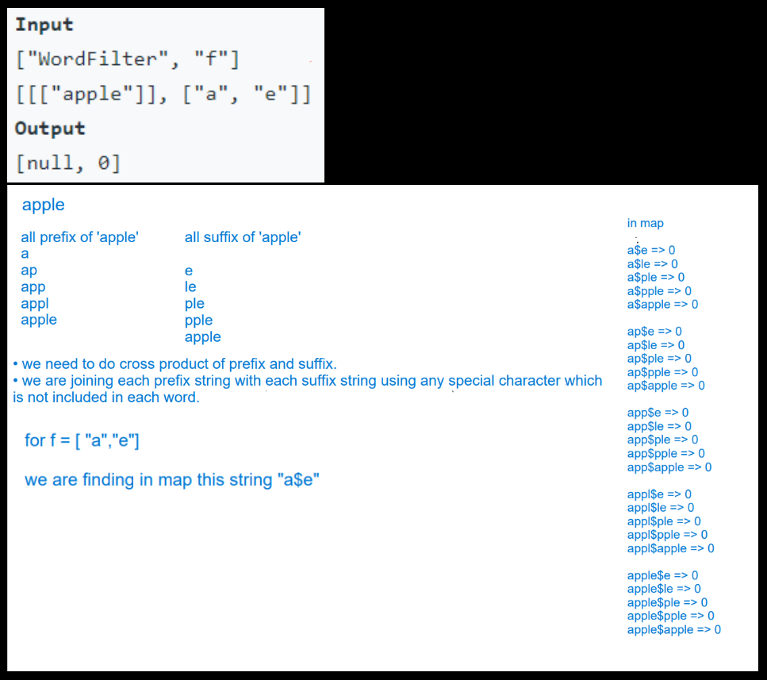

- <h3>Approach (Hashmap Solution)</h3>
    

    

    → we are solving this question by using hashmap.
    

    

    → we are trying to find all possible prefix and suffix string for each word and storing it into the map with their word index.
    

     
    

    

    <h5>Time Complexity: </h5>
    

    → let's take word.length as 'm' and words[i].length as 'n'.
    we are finding all possible prefix+suffix of words[i], that's why WordFilter() constructor will take O(m*n²) and method f will take O(n) time which is negligible.
    

    <h5>Space Complexity:</h5>
    
→ We are using unordered map and storing all possible prefix+suffix string in it so it will use n² space for each word so overall space complexity is O(m*n²).
    

    

- <h3>Reference</h3>
<!-- 1. [Click Here](https://youtu.be/uoFrIIrp5_g) -->
