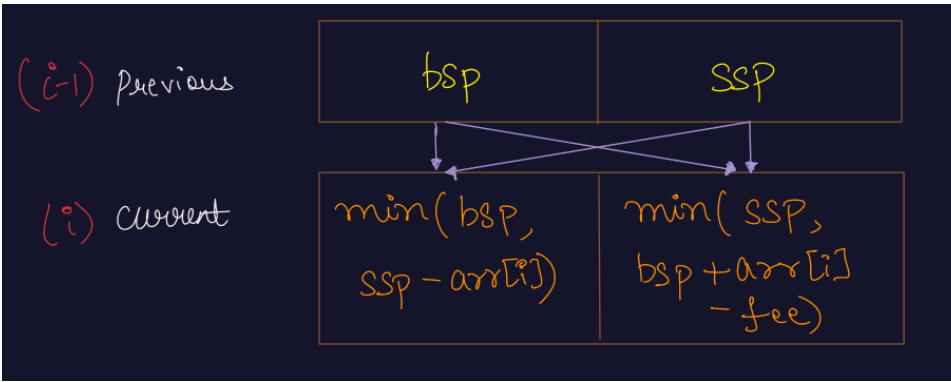

- <h3>Approach (Linear Approach)</h3>
    

    

    → For any day, the first state will be the maximum profit we can make if there is one stock left to be sold. This state does not necessarily require you to buy the stock at the current day. It just requires that there is one stock extra, i.e. the number of stocks bought should be one more than the number of stocks sold so far.
    

    

    → The second state will be the maximum profit we can make if we have no stock available to sell. This state does not necessarily require you to sell the stock at the current day. It just requires that the number of stocks bought should be equal to the number of stocks sold so far.
    

    

    → Let us name the first state as bsp (bought state profit) and the second state as ssp (sold state profit). We will create two arrays, one for each state, of size equal to the number of days.
    Can you derive a relation for the states at day i, using the values of bsp state and ssp state at day i-1?
    

    

    → BSP State: If it is necessary to have one stock extra in our hand, then we have to two options:

    → We can use the ssp state of previous day and buy the stock at current day, i.e. take the maximum profit upto previous day and buy the stock at current day.
    

    

    → Q) Why we cannot take the maximum profit upto previous day from bsp state?
    → R) This is because if we consider the previous day, which already has one stock extra, then buying on the current day will make two stocks extra. But we are not allowed such transactions, as we must sell stock before buying it again.
    

    

    → We do not buy on the current day, but instead use the previous bsp state, i.e. we can take the maximum profit with one stock left upto previous day only. This will make us left with one stock extra only, as we are not buying or selling today.
    

    

    → We will consider that option whichever gives us more profit (or less loss).

    → SSP State: If it is necessary to have to equal number of stocks bought and sold, then we have two options:

    → We take the bsp state of the previous day and sell that extra stock which was left in the previous day's state today. Hence, now, we will be left with no extra stocks in our hand, i.e. the number of stocks bought and sold will become extra.
    → Please remember that selling the stock at the current day means we are completing a transaction ("BS"). Hence we need to reduce the transaction fee also from the profit so far.

    → Q) Why can't we take the ssp state of the previous day and sell a stock today?

    → R) Since ssp state means we do not have any extra stock in our hand, we cannot sell a stock without even buying it first. A state like "SB" is not possible.
    → We take the ssp state of the previous day as it is, and do not buy or sell stock today. Hence, ssp state of previous day, which gives the maximum profit with no stocks left upto previous day will become the maximum profit with no stock left upto the current day.
    → We will consider that option whichever gives us more profit (or less loss).
    

    
    

     
    

    

    → The only task left is to analyze the corner case.

    → It is the first day, when we will not have any previous day.
    → In this case, for the bsp state, we must have to buy the stock at the current day as option 2 is not available.
    → For the ssp state, we do not have any option to sell stock, hence the maximum profit will be 0 (no stocks bought, no stocks sold).
    → Note: Please note that there can be negative value in bsp, or ssp state, which represents we are at a loss. (Profit of -x is equivalent to loss of x).

    → At last, we will return the value of ssp state of the last day as our result, since it will contain the maximum profit with no extra stock left in our hand (no incomplete transaction) and it has taken into account all the n days.

    → Please note that the bsp state of the last day cannot be considered as our result, because it has one incomplete transaction, because there is one stock extra in our hand, which is still left to be sold.
    

    

    

    <h5>Time Complexity: </h5>
    
→ Since, we are running a loop on a 1d array of size n, hence time complexity is O(n).
    

    <h5>Space Complexity:</h5>
    
→ We are not using any extra space, but just a few integer variables, hence O(1) auxiliary space required.
    

    

- <h3>Reference</h3>
<!-- 1. [Click Here](https://youtu.be/uoFrIIrp5_g) -->