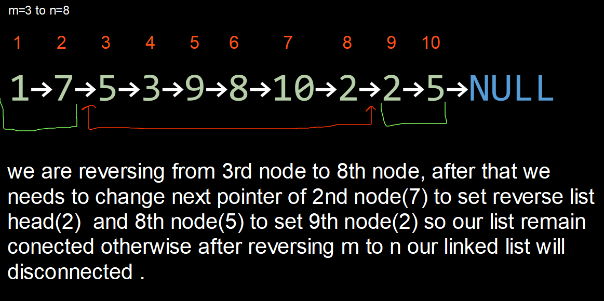

- <h3>Approach (Simple Linear approach)</h3>
    

    

    → first we are trying to find starting point from where we need to reverse linked list.
    

    

    → after that we need reverse n node. 
    → after that we just need to swap some pointers so that linked list will remain connected.
    

     
    

    

    <h5>Time Complexity: </h5>
    
→ Since, we are running a loop on a singly linked list of size n, and reversing linked list from m to n, hence time complexity is O(N).
    

    <h5>Space Complexity:</h5>
    
→ We are not using any extra space, but just a few Node pointers, hence O(1) auxiliary space required.
    

    

- <h3>Reference</h3>
1. [How to Reverse a singly linked list?](https://www.geeksforgeeks.org/reverse-a-linked-list/)