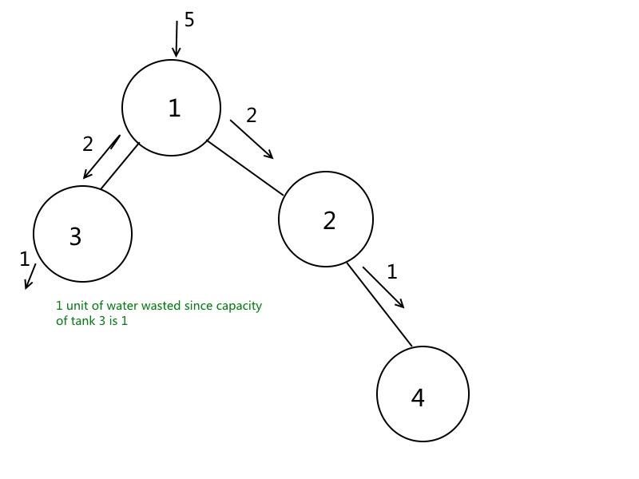

<a href="https://practice.geeksforgeeks.org/problems/fill-the-tank3026/1#"><h1> Fill the Tank </h1></a>

- <h3>Question</h3>
    In a city, N water tanks are connected by pipeline(As a tree) where the ith tank has a capacity cap[i]. The ith element of the given Edge array of length N-1 represents that there is a pipeline between Edge[i][0] and Edge[i][1] tank. Since people working at the city corporation are lazy they usually select one of the tank and pour complete amount of water into it, when the tank is filled, the excess water evenly flows to the connected tanks. The head of city corporation has instructed to pour minimum amount of water into the selected tank so that all other tank is filled. As the labours of the corporation are not intelligent enough to figure out the minimum amount of water required to fill all the tanks they have asked your help. Also Maximum amount of water available with city corporation is 1018.

    NOTE: If the tank if full, the water flows to all of its connected tanks except the tank from which the water had come to it. i.e, to all tanks except the source for that particular tank. If it has no option to flow the water is considered to be wasted. S is the source tank.

- <h3>Examples</h3>
    

    <b>Example 1:</b>

    

    Input: 
    
        N = 4 and S = 1
    
        Edges = [[1, 2], [1, 3], [2, 4]]
    
        Cap = [1, 1, 1, 1]
    Output: 5  
    Explanation: 
    
        Initially 5 unit of water is poured into tank 1. 2 unit of it flows to tank 2 and 2 unit of it flows into tank 3. From 2 unit of water in tank 2, 1 unit flows into tank 4 and 1 unit from tank 3 is wasted.
    

     

- <h3>Constraints</h3>
    → 1 ≤ n ≤ 100000
    
    → 1 ≤ s,u,v ≤ n
    
    → 1 ≤ capacity of each tank ≤ 1000000007

